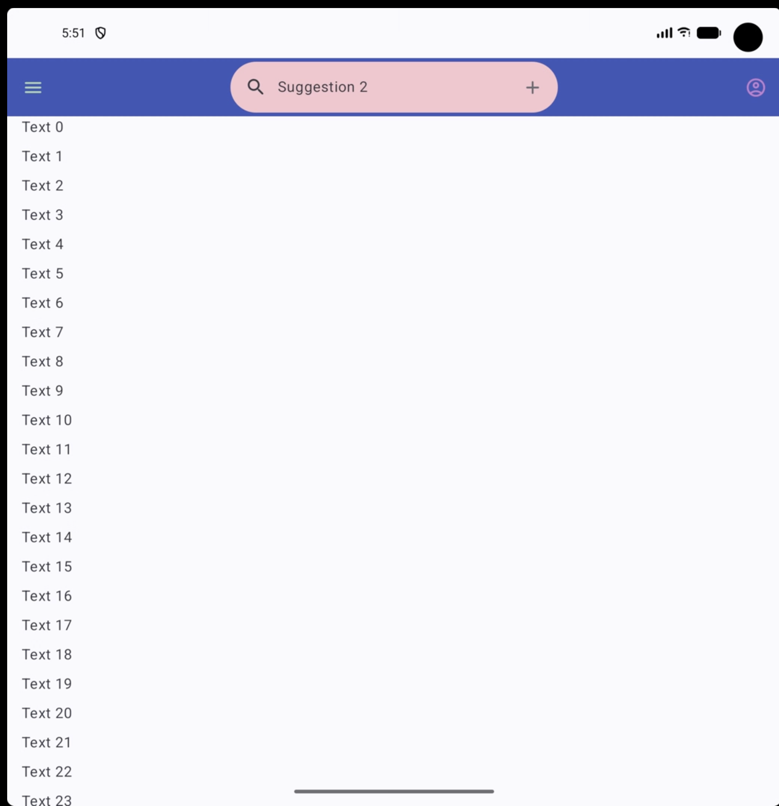
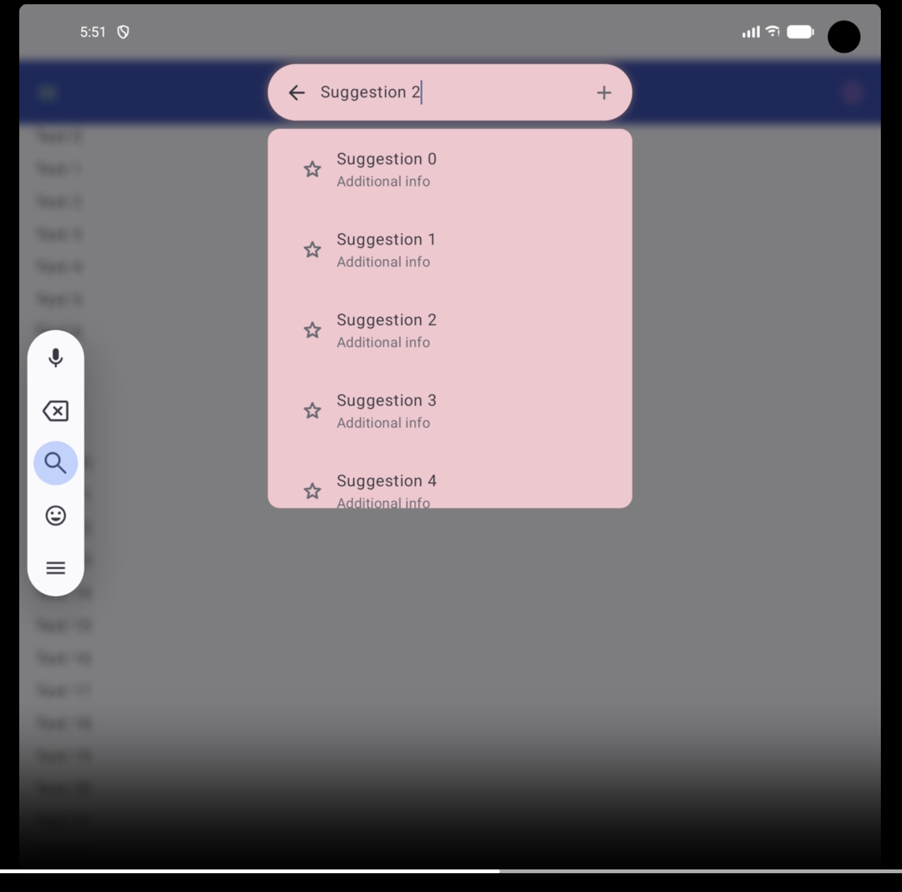

Here I showcase an `AppBarWithSearch` which works as its name says, an app bar(top bar) with a search(search input), previously the `TopSearchBar`
didn't have the ability to add icons and didn't have the look of a top bar(the surface surounding it is always transparent). And I use it along
the new docked search view(the container of search results) that implements the material expressive search "contained" style

